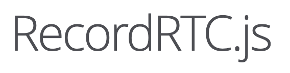

<template v-slot:title> 
  <div class="leading-24 "><span class="text-50px">身為前端工程師</span><br>你有想過用<span class="font-bold  text-center py-.5 px-1 px-10   text-60px w-28 inline-block relative"> 
   
  </span> 做簡報嗎？</div>
</template>

---
class: flex justify-center font-semibold
transition: view-transition
---

<div class="font-bold text-slidev  mb-10 p-1 px-2 text-45px">✌️😃✌️</div>

---
class: flex justify-center font-semibold
transition: view-transition
---

<div class="font-bold text-slidev  mb-10 p-1 px-2 text-38px">而且還連續做了30天</div>

---
class: flex justify-center font-semibold
transition: view-transition
---

<div class=" m-auto h-40 shadow transition-all top-0 right-10 bottom-0 left-0 w-1/2 absolute" :class="{
 'opacity-20': $clicks > 0
}" >
  
</div>

<div class="rounded-full font-bold m-auto bg-[#DA4601]  h-7 shadow-md text-center  text-shadow transition-all  top-0 bottom-5 left-56 leading-7 w-24
  absolute" v-click="1">
  <div class="rounded-full bg-[#DA4601] text-white ">影片教學</div>
</div>
<div class="rounded-full font-bold m-auto   h-8 shadow-md   transition-all   right-74 bottom-52 leading-8 w-50 absolute
  " v-click="2">
  
</div>

---
preload: false
class: text-slidev
clicks: 2
transition: view-transition
---

<div class=" mx-auto mt-20  transition-all top-0 right-10 bottom-0 left-0 w-1/2 absolute"  >
  
</div>

<template v-if=" $clicks === 1 && $page === 5">
  <div class="h-48 ml-70 w-48 relative" >
    <MotionImage :initialOption="{ x: 0, y: -100, scale: 2.1, rotate: -50 }" elSrc="logo-square.png"/>
    <MotionImage :initialOption="{ y: 100, x: -80, scale: 2.1 }" elSrc="logo-circle.png"/>
    <MotionImage :initialOption="{ x: 100, y: 100, scale: 2, rotate: 100 }" elSrc="logo-triangle.png"/>
  </div>
  <div
    class="font-bold mx-auto  right-0 left-0 text-5xl text-[#2B90B6] w-40 -z-1 absolute"
    v-motion
    :initial="{ x: 0,  opacity: 0}"
    :enter="{ x: 55, y:5,  opacity: 1, transition: { delay: 1000, duration: 1000 } }">
    Slidev
  </div>
</template>

<h2 class="font-bold text-center mb-14 w-full" v-if="$clicks === 2 && $page === 5"> 基於 Vue ＆ Vite 的 Markdown 投影片工具 </h2>

---
transition: view-transition
---

<div class=" mx-auto w-full ">
  <div class="flex mx-auto space-x-4 text-center w-80 relative items-center">
    
    <span class=" font-bold  tracking-wide text-[44px] text-[#696969CC] inline-block">UNOCSS</span>
  </div>
</div>

---
transition: view-transition
---

<div class=" mx-auto w-full ">
  <div class="flex mx-auto space-x-4 text-center w-80 relative items-center">
    
    <span class=" font-bold text-shadow tracking-wide text-[48px] text-[#41b883] inline-block">VueUse</span>
  </div>
</div>

---

<div class=" mx-auto w-full ">
  <div class="flex mx-auto space-x-4 text-center w-80 relative items-center">
    
  </div>
</div>

---
layout: question
class: text-slidev
---

# 安裝 Slidev

---
layout: content
class: text-slidev
---

<div class="bg-[#FDEEECB3]  p-1 text-[#CC2014CC] text-16px w-100">
提醒:  Slidev 需要 Node.js >=18.0 以上
</div>


---
layout: question
class: text-slidev
---

# 為什麽 Slidev ?

---
class: text-slidev p-10
layout: content
---

## Componet

<div class="my-10 text-[#696969]">

```html
  
<Counter :count="10" />

```

<!-- ./components/Counter.vue -->
<Counter :count="10" m="t-10" />

</div>

---
class: flex justify-center font-semibold
---

<div class="font-bold text-slidev  mb-10 p-1 px-2 text-40px">CODE<span class="text-5xl  text-[#40B983]">&lt;&gt;</span></div>

---
class: text-slidev p-10 space-y-10
layout: content
---

### HeightLight

突顯某部分重要程式碼片段時，可使用 Markdown 中的三個反引號（```）來指定程式碼區塊，同時在後面指定程式碼的語言。

<div class="mt-5">

```ts {all|2-8|10-15|13|all}

interface User {
  id: number
  firstName: string
  lastName: string
  role: string
}

//...略

function updateUser(id: number, update: User) {
  const user = getUser(id)
  const newUser = { ...user, ...update }
  saveUser(id, newUser)
}

```

<arrow v-click="[3, 4]" x1="450" y1="500" x2="310" y2="420" color="#564" width="3" arrowSize="1" />

</div>

<!--
{lines:true}
-->

---
class: text-slidev p-10 space-y-10
layout: content
---

### Monaco Editor  &  Monaco Diff 

<div class="flex space-x-6 mt-5">

<div class="w-1/2">


```ts {monaco}

interface User {
  id: number
  firstName: string
  lastName: string
  role: string
}

//...略

function updateUser(id: number, update: User) {
  const user = getUser(id)
  const newUser = { ...user, ...update }
  saveUser(id, newUser)
}

```

</div>

<div class="w-1/2" v-click="1">

```ts {monaco-diff}
removed on the right.
just some text
abcd
efgh
Some more text
~~~
just some text
abcz
zzzzefgh
Some more text.
```

</div>


</div>

---
class: flex justify-center font-semibold
---

<div class="font-bold text-slidev  mb-10 p-1 px-2 text-38px">Animations</div>

---
class: text-slidev p-10
layout: content
---

<div class="bg-slidev font-semibold text-white text-center mb-6 py-.5 px-1 text-22px w-20"> v-click </div>
<span class="font font-medium my-1 text-xl text-[#696969] block">DEMO:</span>
<div class="my-5 tracking-wide relative" >
  <div class="bg-[#f1f1f1] p-2 text-[#696969]" >
    <span :class="$clicks === 1? 'opacity-100': 'opacity-0'">我是點擊第 <span class="text-2xl">{{ $clicks }}</span> 次 出現的</span>
    <span class="pl-2" v-if="$clicks >= 2">我是點擊第 <span class="text-2xl">2</span> 次 出現的</span>
    <span class="border border-red bg-[#FFFFFF4D] border-2 h-12 py-2 px-1 top-0 left-0 w-44 scale-110 block absolute" v-if="$clicks === 2"></span>
    <span class="bg-slidev h-12 text-white py-2 px-1  transition-all top-0 ease-linear left-100 w-46 duration-500 block absolute " 
       :class="$clicks === 3? 'opacity-100 -translate-x-0': 'opacity-0 -translate-x-40'" >我是點擊第 <span class="text-2xl">{{ $clicks }}</span> 次 出現的</span>
  
  </div>
</div>

<span class="font font-medium my-1 text-xl text-[#696969] block">程式碼:</span>

<div >

```html {all|4|5|6}

<div class="border my-10 tracking-wide relative">
  <div class="bg-[#f1f1f1] p-2 text-[#696969]" >
    <span v-click="[1,2]">我.. <span class="text-2xl">{{ $clicks }}</span> ..出現的</span>
    <span v-click="2">我是點擊第 <span class="text-2xl">2</span> 次 出現的</span>
    <span class="transition-all ease-linear duration-500" :class="$clicks === 3? 'opacity-100': 'opacity-0'" >...{{ $clicks }}...</span>
  </div>
</div>
```
</div>


---
class: text-slidev p-10
layout: content
preload: false
---

<div class="bg-slidev font-semibold text-white text-center mb-6 py-.5 px-1 text-22px w-30"> v-motion </div>

<div class="flex h-full ">

<div class="pt-14 w-1/2">

```html{all|2|3-6|7-12|all}
  

```
</div>

<div class="w-1/2 " v-if="$clicks > 3">
  <div class="h-48 mt-24 ml-8 w-48 relative" >
    <MotionImage :initialOption="{ x: 0, y: 0, scale: 2.1, rotate: -50 }" elSrc="logo-square.png"/>
    <MotionImage :initialOption="{ y: 0, x: 0, scale: 2.1 }" elSrc="logo-circle.png"/>
    <MotionImage :initialOption="{ x: 0, y: 0, scale: 2, rotate: 100 }" elSrc="logo-triangle.png"/>
  </div>
  <div
    class="font-bold mx-auto  right-0 left-0 text-5xl text-[#2B90B6] w-40 -z-1 absolute"
    v-motion
    :initial="{ x:230,  opacity: 0}"
    :enter="{ x:280 , y:-120,  opacity: 1, transition: { delay: 1000, duration: 1000 } }">
    Slidev
  </div>
</div>

</div>

---
class: flex justify-center font-semibold
---

<div class="font-bold text-slidev  mb-10 p-1 px-2 text-38px">Recording 🎥</div>

---
class: flex justify-center font-semibold
---

<div class="font-bold text-slidev  mb-10 p-1 px-2 text-38px">Export  📤</div>

---
class: flex-wrap px-10 space-y-10 text-slidev pt-10
layout: content
---

### 安裝 playwright-chromium

<div class="mt-10">

```
npm i -D playwright-chromium

```
</div>

<div class="w-full" v-click="1">

<div class="font-semibold  my-6 text-slidev text-left py-.5 px-1 text-24px w-30"> PDF </div>

```
slidev export --with-clicks --output my-pdf-export

```
</div>

<div class="w-full" v-click="2">
<div class="font-semibold my-6 text-slidev text-left py-.5 px-1 text-24px  w-30"> PNG </div>

```
slidev export --format png

```
</div>


---
layout: center
class: text-center text-slidev
---


# 更多功能

[Documentations](https://sli.dev) · [GitHub](https://github.com/slidevjs/slidev) · [Showcases](https://sli.dev/showcases.html)

<div class="bg-slidev mx-auto h-4 right-0 bottom-0 left-0 absolute">
</div>

---
layout: question
class: text-slidev 
---

# 相較其他『簡報工具』優勢 

---
class: flex justify-center font-semibold
---

<div class="bg-slidev text-white mb-10 p-1 px-2 text-30px">DEMO</div>

---
class: flex justify-center font-semibold
transition: view-transition
---

<div class="bg-slidev text-white mb-10 p-1 px-2 text-30px">最後</div>

---
class: flex justify-center font-semibold
transition: view-transition
---

<div class="text-slidev  mb-10 p-1 px-2 text-30px">『 先做做看就知道了 』</div>

---
class: flex justify-center font-semibold
---

<div class="text-slidev  mb-10 p-1 px-2 text-30px"> 焦慮有一天會變成規律 </div>

---
